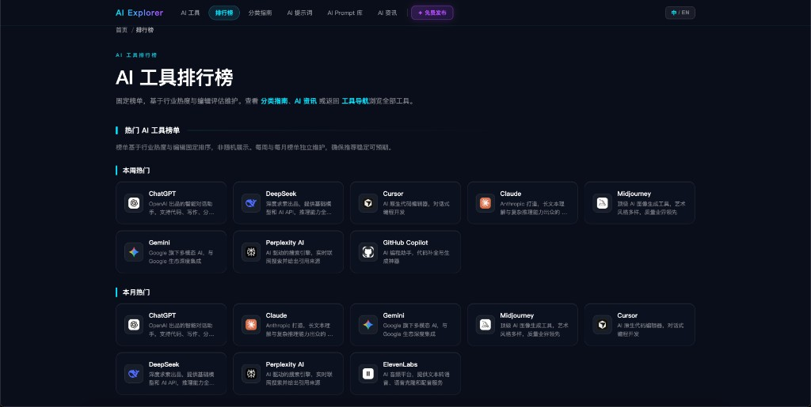

<div align="center">

# AI Explorer

### 精选 AI 工具，一站直达。

**Publish Your AI Tool. Get Discovered.**

<br />

[](https://www.aiexplore.top/)
[](https://www.aiexplore.top/submit)
[](https://github.com/liaceboy/AI-Explorer-Web)
[](#-license)

<br />

**[🌐 Visit Website](https://www.aiexplore.top/)** · **[🚀 Submit AI Tool — Free](https://www.aiexplore.top/submit)** · **[⭐ Star on GitHub](https://github.com/liaceboy/AI-Explorer-Web)**

<br />

> AI Explorer 是 **1000+** 精选 AI 工具的导航目录 — 帮助用户发现工具，也帮助开发者**免费发布** AI 产品。

<br />

<a href="https://www.aiexplore.top/">
  
</a>

<br />

*探索 AI 宇宙 · 1000+ 精选工具 · 分类导航 · 免费发布入口*

</div>

<br />

## 📑 目录

| | |
|:---|:---|
| [Why AI Explorer](#-why-ai-explorer) | [Features](#-features) |
| [Submit Your AI Tool](#-submit-your-ai-tool) | [Perfect For](#-perfect-for) |
| [Getting Started](#-getting-started) | [Product Tour](#-product-tour) |
| [Roadmap](#-roadmap) | [FAQ](#-faq) |

<br />

---

## ✦ Why AI Explorer

AI 工具更新太快，信息太散 — ChatGPT、Claude、Cursor、Midjourney 等产品每天涌现。

**AI Explorer** 连接两类用户：

<table>
<tr>
<th align="left">发现工具</th>
<th align="left">发布工具</th>
</tr>
<tr>
<td valign="top">

🧭 **1000+** 精选 AI Tools，7 大分类

📊 排行榜与分类指南

📚 Prompt、教程与 AI News

</td>
<td valign="top">

🚀 **免费提交**，人工审核收录

🌍 面向全球开发者与创作者展示

✅ 优质工具进入推荐与榜单

</td>
</tr>
</table>

<br />

---

## ✦ Features

| | | |
|:---|:---|:---|
| 🚀 **Free Submission** | 🧭 **AI Directory** | 📊 **Rankings** |
| 永久免费提交 AI 工具 | 1000+ 工具 · 7 大分类 | 本周 / 本月热门榜 |
| ✍️ **AI Prompt** | 📰 **AI News** | 🔍 **Site Search** |
| Prompt 库 + 绘画生成器 | 资讯、教程与应用案例 | 分类 Tab + 目录搜索 |

<br />

---

## 🚀 Submit Your AI Tool

<div align="center">

独立开发者、创业团队与 AI 产品方 — **永久免费收录**，审核通过后即可在目录展示。

</div>

| | |
|:---|:---|
| ✅ | **永久免费** — 无需付费即可收录 |
| ✅ | **人工审核** — 保证目录质量与可信度 |
| ✅ | **全球曝光** — 面向开发者与 AI 爱好者展示 |

<div align="center">

<br />

[](https://www.aiexplore.top/submit)

<br />

**[→ aiexplore.top/submit](https://www.aiexplore.top/submit)**

</div>

<br />

---

## ✦ Perfect For

| 角色 | 你能获得 |
|:---|:---|
| 🧑‍💻 **开发者** | 发现 Cursor、Copilot 等 Dev Tools |
| 🎨 **设计师 / 创作者** | 对比 Midjourney、Flux；使用 Prompt 工具 |
| 🚀 **AI 产品方** | **免费提交工具**，获取曝光与用户反馈 |
| 🎓 **学习者** | 分类指南 + 教程，系统掌握 AI 工作流 |

<br />

---

## ✦ Getting Started

本仓库是 [AI Explorer](https://www.aiexplore.top/) 的前端 **UI Showcase**，使用 Mock 数据复刻首页导航与站内搜索。

### 环境要求

- [Node.js](https://nodejs.org/) 18+
- npm 9+（或 pnpm / yarn）

### 安装与运行

```bash
git clone https://github.com/liaceboy/AI-Explorer-Web.git
cd AI-Explorer-Web

npm install
npm run dev
```

浏览器打开 [http://localhost:5173](http://localhost:5173)。

### 常用命令

| 命令 | 说明 |
| --- | --- |
| `npm run dev` | 启动 Vite 开发服务器 |
| `npm run build` | TypeScript 检查并构建到 `dist/` |
| `npm run preview` | 本地预览生产构建 |

### 项目结构

```
src/
├── components/   # Header、SearchAgent、ToolCard 等
├── data/         # Mock 工具与搜索数据
├── hooks/        # 语言切换
└── App.tsx
```

| | 本仓库 | [aiexplore.top](https://www.aiexplore.top/) |
| --- | --- | --- |
| 定位 | 开源 UI Showcase | 完整线上产品 |
| 数据 | Mock | 实时目录与内容 |

<br />

---

## ✦ Product Tour

> 截图来自 **[aiexplore.top](https://www.aiexplore.top/)** 线上产品

<br />

#### 01 · AI 工具导航

<a href="https://www.aiexplore.top/tools">
  
</a>

<p align="center"><strong><a href="https://www.aiexplore.top/tools">Explore AI Tools →</a></strong></p>

<br />

#### 02 · AI 工具排行榜

<a href="https://www.aiexplore.top/rankings">
  
</a>

<p align="center"><strong><a href="https://www.aiexplore.top/rankings">View Rankings →</a></strong></p>

<br />

#### 03 · AI Prompt 库

<a href="https://www.aiexplore.top/prompt-generator?mode=chat">
  
</a>

<p align="center"><strong><a href="https://www.aiexplore.top/prompt-generator?mode=chat">Browse Prompt Library →</a></strong></p>

<br />

#### 04 · AI 绘画提示词生成器

<a href="https://www.aiexplore.top/prompt-generator">
  
</a>

<p align="center"><strong><a href="https://www.aiexplore.top/prompt-generator">Open Prompt Generator →</a></strong></p>

<br />

#### 05 · AI 资讯 & 学习中心

<a href="https://www.aiexplore.top/articles">
  
</a>

<p align="center"><strong><a href="https://www.aiexplore.top/articles">AI News →</a></strong> · <strong><a href="https://www.aiexplore.top/learning">Learning Hub →</a></strong></p>

<br />

---

## ✦ Roadmap

| 状态 | 里程碑 |
|:---:|:---|
| ✅ | **1000+** AI Tools · 7 大分类 · 详情页 |
| ✅ | Rankings · Prompt Tools · AI News |
| ✅ | **Free AI Tool Submission** — [submit](https://www.aiexplore.top/submit) |
| 🚧 | GitHub UI Showcase 持续对齐官网 |

<br />

---

## ✦ FAQ

<details>
<summary><strong>提交 AI 工具真的免费吗？</strong></summary>
<br />

是的。**永久免费收录**，人工审核后上线，优质工具可进入推荐与排行榜。

</details>

<details>
<summary><strong>谁适合提交工具？</strong></summary>
<br />

独立开发者、创业团队、AI SaaS、开源项目与 API 服务 — 面向 AI 用户的产品均欢迎提交。

</details>

<details>
<summary><strong>这个 GitHub 仓库和官网有什么区别？</strong></summary>
<br />

**官网** — 完整 AI Directory + 免费提交入口  
**本仓库** — 开源 UI Showcase（Mock 数据），可本地运行预览

</details>

<br />

---

## ✦ License

MIT — UI Showcase 源码可自由参考与 Fork。  
网站内容与工具目录版权归 [AI Explorer](https://www.aiexplore.top/) 所有。

<br />

---

<div align="center">

[](https://github.com/liaceboy/AI-Explorer-Web)
[](https://www.aiexplore.top/)
[](https://www.aiexplore.top/submit)

<br />

© 2026 [AI Explorer](https://www.aiexplore.top/) · [Contact](https://www.aiexplore.top/contact)

</div>
